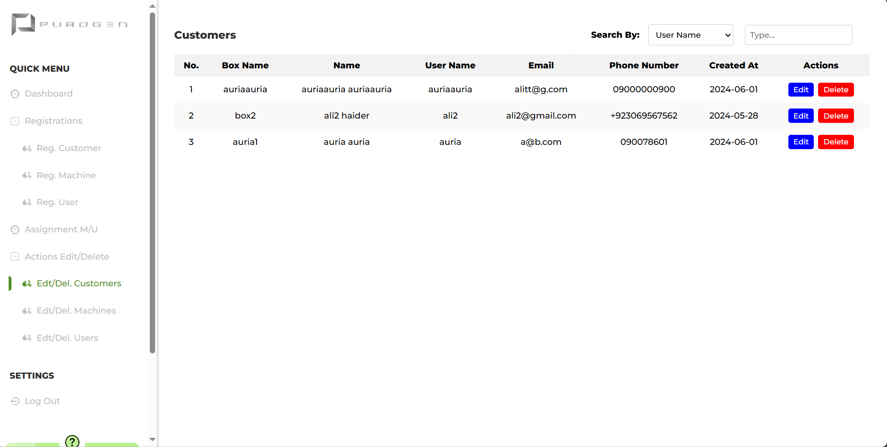

# 1. Overview of Requirements
<details>
<summary>Revised Requirements V0.0.2 </summary>

## Purogen Project Briefing

### Overview
Purogen specializes in providing customers with specific machines equipped with PLC services. The company aims to enhance their offerings by sending machine data to the cloud and associating this data with specific customers and their workers through a robust web application.

### Hardware Integration
The project involves integrating machine data with cloud services, ensuring each machine's data is accurately associated with the correct customer and their workers. This integration is crucial for providing real-time data access and management capabilities through the web application.

<details>

<summary>Machine Data Parameters </summary>

***Following Parameters need to go to RDBMS at AWS Cloud***
- Customer ID
- Machine ID
- Machine Location
- Processes
- Recipe
- Weight
- Mass
- Strain
- Terpene Name
- Manufacturer Name
- Injection Volume
- Injections
- Operator
- Customer Name
- Chamber
- Temporary1
- Temporary2
- Temporary3
- Created At
- Updated At

</details>

## Web Application Functionality
The web application will provide the following functionalities:

- **Registration:**
  - Admins can register customers, machines, and workers.
- **Assignment:**
  - Admins can assign machines to customers and workers to specific machines.
- **Data Monitoring:**
  - Real-time machine data monitoring for admins, customers, and workers.
- **Access Control:**
  - Fine-grained access control managed by admins and customers.

## Dashboards

### 1. Admin Dashboard
The Admin Dashboard is exclusively accessible to Purogen administrators. This dashboard provides comprehensive control over the system, including:

- **Customer Management:**
  - Register new customers.
  - Edit or delete existing customer information.
- **Machine Management:**
  - Register new machines and assign them to customers.
  - Edit or delete machine information.
- **Worker Management:**
  - Register new workers and assign them to customers and specific machines.
  - Edit or delete worker information.
- **Data Monitoring:**
  - View machine data for all customers.
- **Access Control:**
  - Manage customer and worker access to their respective dashboards.

### 2. Customer Dashboard
The Customer Dashboard is designed for customer use, providing access to relevant information and control over their workers and machines:

- **Machine Overview:**
  - View the list of machines registered and assigned to them by the admin.
  - Monitor machine data in real-time.
- **Worker Overview:**
  - View the list of workers registered and assigned to them by the admin.
- **Worker Management:**
  - Assign or unassign workers to/from machines.
  - Edit or delete worker information.
- **Access Control:**
  - Manage worker access to their dashboards.

### 3. Worker Dashboard
The Worker Dashboard is tailored for individual workers, offering a focused view of their assigned machines:

- **Machine Data:**
  - Access and monitor data from machines assigned to them.
- **Personal Access:**
  - Only registered workers can access this dashboard.

By implementing these features, Purogen aims to enhance their service offerings, streamline machine data management, and improve overall customer satisfaction.
</details>

<!-- --------------------------------------------- -->

# 2. Architecture Design
<details>
<summary>Initial Architecture V0.0.2</summary>

## V0.0.1

## V0.0.2


</details>
<!-- ---------------------------------------------- -->

# 3. Developed Directory Structure Purogen Admin Dashboard

<details>
<summary>Admin Dashboard V0.0.2 </summary>

```bash
purogen_website
├── assets
|  ├── architecture.png
|  ├── preview_dashboard.png
|  └── preview_login.png
├── client
|  ├── index.html
|  ├── package-lock.json
|  ├── package.json
|  ├── src
|  |  ├── App.css
|  |  ├── App.css.map
|  |  ├── App.jsx
|  |  ├── App.scss
|  |  ├── Assets
|  |  |  ├── aldi.jpg
|  |  |  ├── bannerImg.jpeg
|  |  |  ├── dadang.jpg
|  |  |  ├── gilbert.jpg
|  |  |  ├── images (1).png
|  |  |  ├── images (10).png
|  |  |  ├── images (2).png
|  |  |  ├── images (3).png
|  |  |  ├── images (4).png
|  |  |  ├── images (5).png
|  |  |  ├── images (6).png
|  |  |  ├── images (7).png
|  |  |  ├── images (8).png
|  |  |  ├── images (9).png
|  |  |  ├── logo.png
|  |  |  ├── purogen.png
|  |  |  ├── purogen_horizontal.png
|  |  |  └── video.mp4
|  |  ├── Components
|  |  |  ├── Actions
|  |  |  |  ├── Customers.jsx
|  |  |  |  ├── Machines.jsx
|  |  |  |  └── Users.jsx
|  |  |  ├── AssignmentMU
|  |  |  |  ├── RegisteredMachineInfo.jsx
|  |  |  |  └── RegisterMachine.jsx
|  |  |  ├── Dashboard
|  |  |  |  ├── BodySection
|  |  |  |  |  ├── ActivitySection
|  |  |  |  |  |  ├── activity.scss
|  |  |  |  |  |  ├── MachineDataActivity.jsx
|  |  |  |  |  |  └── MachineListingActivity.jsx
|  |  |  |  |  ├── Body.jsx
|  |  |  |  |  ├── ListingSection
|  |  |  |  |  |  └── Listing.jsx
|  |  |  |  |  └── TopSection
|  |  |  |  |     └── Top.jsx
|  |  |  |  ├── Dashboard.jsx
|  |  |  |  └── SideBarSection
|  |  |  |     ├── sidebar.css
|  |  |  |     ├── sidebar.css.map
|  |  |  |     ├── Sidebar.jsx
|  |  |  |     └── sidebar.scss
|  |  |  ├── LittleBlocks
|  |  |  |  └── DropDownRegisters.jsx
|  |  |  ├── Login
|  |  |  |  ├── Login.css
|  |  |  |  ├── Login.css.map
|  |  |  |  ├── Login.jsx
|  |  |  |  └── Login.scss
|  |  |  ├── NotFound
|  |  |  |  └── NotFound.jsx
|  |  |  └── Register
|  |  |     ├── Customer
|  |  |     |  ├── RegisterCustomer.jsx
|  |  |     |  └── RegisteredCustomerInfo.jsx
|  |  |     ├── Machine
|  |  |     |  ├── RegisteredMachineInfo.jsx
|  |  |     |  └── RegisterMachine.jsx
|  |  |     └── User
|  |  |        ├── RegisteredUserInfo.jsx
|  |  |        └── RegisterUser.jsx
|  |  ├── dustBin
|  |  |  └── AssignmentMachinesUsers.jsx
|  |  ├── hooks
|  |  |  ├── AuthContext.jsx
|  |  |  └── authenticationReducer.jsx
|  |  ├── main.jsx
|  |  ├── Routes
|  |  |  ├── index.jsx
|  |  |  ├── privateRoutes.jsx
|  |  |  └── routes.jsx
|  |  ├── store
|  |  |  ├── actions
|  |  |  |  └── authActions.jsx
|  |  |  ├── index.jsx
|  |  |  ├── reducers
|  |  |  |  └── authenticationReducer.jsx
|  |  |  └── store.jsx
|  |  ├── styles
|  |  |  ├── base
|  |  |  |  ├── root.scss
|  |  |  |  ├── typography.scss
|  |  |  |  └── utilites.scss
|  |  |  ├── dashboard
|  |  |  |  ├── bodySection
|  |  |  |  |  ├── activity
|  |  |  |  |  |  └── activity.scss
|  |  |  |  |  ├── body.scss
|  |  |  |  |  ├── listings
|  |  |  |  |  |  └── listing.scss
|  |  |  |  |  └── top
|  |  |  |  |     └── top.scss
|  |  |  |  ├── dashboard.scss
|  |  |  |  └── sidebar
|  |  |  |     └── sidebar.scss
|  |  |  ├── LittleBlocks
|  |  |  |  ├── download_buttons.scss
|  |  |  |  └── edit_delete_buttons.scss
|  |  |  ├── mediaQueries
|  |  |  |  └── mediaQueries.scss
|  |  |  ├── Modals
|  |  |  |  └── actionModals.scss
|  |  |  ├── register
|  |  |  |  └── register.scss
|  |  |  └── signin
|  |  |     └── signin.scss
|  |  └── utils
|  |     └── PrivateRoute.jsx
|  └── vite.config.js
├── package-lock.json
├── readme.md
├── rquirements
|  ├── check list.odt
|  ├── locked requirements.pdf
|  ├── progress.docx
|  ├── PurogenAdminDashboardV0.0.1.pdf
|  ├── Requirements Locked V0.0.1.pdf
|  ├── Requirements Locked V0.0.2.pdf
|  └── todo 0.0.2.txt
└── server
   ├── index.js
   ├── package-lock.json
   ├── package.json
   └── src
      ├── config
      |  ├── database.js
      |  └── purogen_database_design.sql
      ├── middleware
      |  ├── dataValidator.js
      |  └── tokenValidator.js
      ├── models
      |  ├── AdminRegistrationModel.js
      |  ├── AdminSessionsModel.js
      |  ├── CustomerMachineDataModel.js
      |  ├── CustomerRegistrationModel.js
      |  ├── ignoreCustomerMachineAssignmentModel.js
      |  ├── ignoreCustomerUserAssignmentModel.js
      |  ├── MachineRegistrationModel.js
      |  ├── UserMachineAssignmentModel.js
      |  └── UserRegistrationModel.js
      └── routes
         ├── AssignmentRoutes
         |  ├── ignoreCustomerMachineAssinment.js
         |  ├── ignoreCustomerUserAssinment.js
         |  └── UserMachineAssignment.js
         ├── AuthRoutes
         |  ├── LogOut.js
         |  └── SignIn.js
         ├── DeleteRoutes
         |  ├── DeleteCustomer.js
         |  ├── DeleteMachine.js
         |  └── DeleteUser.js
         ├── EditRoutes
         |  ├── EditCustomer.js
         |  ├── EditMachine.js
         |  └── EditUser.js
         ├── RegistrationRoutes
         |  ├── AdminRegistrationRoute.js
         |  ├── CustomerRegistrationRoute.js
         |  ├── MachineRegistrationRoute.js
         |  └── UserRegistration.js
         ├── UpdateRoutes
         └── VisulizationDataRoutes
            ├── AllCustomersMachinesData.js
            ├── AllRegisteredCustomers.js
            ├── AllRegisteredMachines.js
            ├── AllRegisteredUsers.js
            ├── ParticularCustomerMachineData.js
            └── ParticularCustomerMachines.js
```

</details>
<!-- ---------------------------------------------- -->

# 4. Preview Developed Front-End 

<details>
<summary> Admin Dashboard Front-End V0.0.2 </summary>

## Front-End Preview
### Sign In


### Dashboard


### Machine Data Modal


### Downloaded Machine Data


### Registrations


### Actions


### Edit Action


### Delete Action


### User Machine Assignment


</details>

# 5. Preview Developed Back-End

<details>

<summary>Admin Dashboard Back-End V0.0.2 API Testing Through Postman</summary>

### Postman Back-End Testing

</details>

# 6. RDBMS MySQL WorkBench Schema PuroGen V0.0.2

<details>

<summary>Preview MySQL WorkBench Local Server</summary>

## MySQL WorkBench Local Server


</details>
<details>
<summary>PuroGen Schema Preview</summary>
<ul>

<details>
<summary>V0.0.1</summary>

```bash
=========================================================
                    REQUIEMENTS 0.0.1
=========================================================

-- Create the purogen database
CREATE DATABASE IF NOT EXISTS purogen;

-- Switch to the purogen database
USE purogen;

-- Create the Users table
CREATE TABLE IF NOT EXISTS Users (
    user_id VARCHAR(36) PRIMARY KEY,
    username VARCHAR(50) UNIQUE,
    first_name VARCHAR(50),
    last_name VARCHAR(50),
    phone_number VARCHAR(15) UNIQUE,
    password VARCHAR(255),
    email VARCHAR(100) UNIQUE,
    admin BOOLEAN DEFAULT FALSE, -- New column for admin status
    created_at TIMESTAMP DEFAULT CURRENT_TIMESTAMP,
    updated_at TIMESTAMP DEFAULT CURRENT_TIMESTAMP ON UPDATE CURRENT_TIMESTAMP
);

CREATE TABLE IF NOT EXISTS User_Data (
    user_data_id VARCHAR(36) PRIMARY KEY,
    user_id VARCHAR(36),
    recipe VARCHAR(50),
    weight INT,
    mass VARCHAR(50),
    process VARCHAR(50),
    strain VARCHAR(50),
    operator VARCHAR(50),
    terpene_name VARCHAR(50),
    manufacturer_name VARCHAR(50),
    injection_volume INT,
    injections VARCHAR(50),
    customer_name VARCHAR(50),
    customer_id VARCHAR(50),
    Machine_ID VARCHAR(50),
    Machine_Location VARCHAR(50),
	created_at TIMESTAMP DEFAULT CURRENT_TIMESTAMP,
    updated_at TIMESTAMP DEFAULT CURRENT_TIMESTAMP ON UPDATE CURRENT_TIMESTAMP,
    FOREIGN KEY (user_id) REFERENCES Users(user_id) ON DELETE CASCADE
);

-- Create the User_Sessions table
CREATE TABLE IF NOT EXISTS User_Sessions (
    session_id VARCHAR(255) PRIMARY KEY,
    user_id VARCHAR(36),
    created_at TIMESTAMP DEFAULT CURRENT_TIMESTAMP,
    expires_at TIMESTAMP,
    FOREIGN KEY (user_id) REFERENCES Users(user_id) ON DELETE CASCADE
);

```
</details>

<details>
<summary>V0.0.2</summary>

```bash
=========================================================
                 REQUIEMENTS 0.0.2
=========================================================

-- Create the purogen database
CREATE DATABASE IF NOT EXISTS purogen;

-- Switch to the purogen database
USE purogen;

CREATE TABLE IF NOT EXISTS Admins_Table (
    admin_id VARCHAR(36) PRIMARY KEY,
    username VARCHAR(50) UNIQUE,
    first_name VARCHAR(50),
    last_name VARCHAR(50),
    phone_number VARCHAR(15) UNIQUE,
    password VARCHAR(255),
    email VARCHAR(100) UNIQUE,
    created_at TIMESTAMP DEFAULT CURRENT_TIMESTAMP,
    updated_at TIMESTAMP DEFAULT CURRENT_TIMESTAMP ON UPDATE CURRENT_TIMESTAMP
);

-- Create the Customers table
CREATE TABLE IF NOT EXISTS Customers_Table (
    customer_id VARCHAR(36) PRIMARY KEY,
    username VARCHAR(50) UNIQUE,
    box_name VARCHAR(50) UNIQUE,
    first_name VARCHAR(50),
    last_name VARCHAR(50),
    phone_number VARCHAR(15) UNIQUE,
    password VARCHAR(255),
    email VARCHAR(100) UNIQUE,
    created_at TIMESTAMP DEFAULT CURRENT_TIMESTAMP,
    updated_at TIMESTAMP DEFAULT CURRENT_TIMESTAMP ON UPDATE CURRENT_TIMESTAMP
);

-- Create the Users table with a reference to the Customers table
CREATE TABLE IF NOT EXISTS Users_Table (
    user_id VARCHAR(36) PRIMARY KEY,
    customer_id VARCHAR(36),
    username VARCHAR(50) UNIQUE,
    first_name VARCHAR(50),
    last_name VARCHAR(50),
    phone_number VARCHAR(15) UNIQUE,
    password VARCHAR(255),
    email VARCHAR(100) UNIQUE,
    created_at TIMESTAMP DEFAULT CURRENT_TIMESTAMP,
    updated_at TIMESTAMP DEFAULT CURRENT_TIMESTAMP ON UPDATE CURRENT_TIMESTAMP,
    FOREIGN KEY (customer_id) REFERENCES Customers_Table(customer_id)
);

-- Create the Machine_Registration table with a reference to the Customers table
CREATE TABLE IF NOT EXISTS Machine_Registration_Table (
    machine_register_id VARCHAR(36) PRIMARY KEY,
    customer_id VARCHAR(36),
    machine_id VARCHAR(50) UNIQUE,
    machine_location VARCHAR(50),
    created_at TIMESTAMP DEFAULT CURRENT_TIMESTAMP,
    updated_at TIMESTAMP DEFAULT CURRENT_TIMESTAMP ON UPDATE CURRENT_TIMESTAMP,
    FOREIGN KEY (customer_id) REFERENCES Customers_Table(customer_id)
);

-- Create the Customers_Machine_Data table
CREATE TABLE IF NOT EXISTS Customers_Machine_Data_Table (
    customers_machine_data_id VARCHAR(36) PRIMARY KEY,
    customer_id VARCHAR(36),
    machine_id VARCHAR(50),
    machine_location VARCHAR(50),
    processes VARCHAR(50),
    recipe VARCHAR(50),
    weight INT,
    mass VARCHAR(50),
    strain VARCHAR(50),
    terpene_name VARCHAR(50),
    manufacturer_name VARCHAR(50),
    injection_volume INT,
    injections VARCHAR(50),
    operator VARCHAR(50),
    customer_name VARCHAR(50),
    chamber VARCHAR(50),
    temporary1 VARCHAR(50),
    temporary2 VARCHAR(50),
    temporary3 VARCHAR(50),
    created_at TIMESTAMP DEFAULT CURRENT_TIMESTAMP,
    updated_at TIMESTAMP DEFAULT CURRENT_TIMESTAMP ON UPDATE CURRENT_TIMESTAMP,
    FOREIGN KEY (customer_id) REFERENCES Customers_Table(customer_id) ON DELETE CASCADE,
    FOREIGN KEY (machine_id) REFERENCES Machine_Registration_Table(machine_id) ON DELETE CASCADE
);

-- Create the Admin_Sessions table
CREATE TABLE IF NOT EXISTS Admin_Sessions (
    admin_session_id VARCHAR(255) PRIMARY KEY,
    admin_id VARCHAR(36),
    created_at TIMESTAMP DEFAULT CURRENT_TIMESTAMP,
    expires_at TIMESTAMP,
    FOREIGN KEY (admin_id) REFERENCES Admins_Table(admin_id) ON DELETE CASCADE
);

-- Create the Customer_Sessions table
CREATE TABLE IF NOT EXISTS Customer_Sessions (
    customer_session_id VARCHAR(255) PRIMARY KEY,
    customer_id VARCHAR(36),
    created_at TIMESTAMP DEFAULT CURRENT_TIMESTAMP,
    expires_at TIMESTAMP,
    FOREIGN KEY (customer_id) REFERENCES Customers_Table(customer_id) ON DELETE CASCADE
);

-- Create the User_Sessions table
CREATE TABLE IF NOT EXISTS User_Sessions (
    user_session_id VARCHAR(255) PRIMARY KEY,
    user_id VARCHAR(36),
    created_at TIMESTAMP DEFAULT CURRENT_TIMESTAMP,
    expires_at TIMESTAMP,
    FOREIGN KEY (user_id) REFERENCES Users_Table(user_id) ON DELETE CASCADE
);

CREATE TABLE IF NOT EXISTS User_Machine_Assignment_Table (
    user_machine_assignment_id VARCHAR(36) PRIMARY KEY DEFAULT (UUID()),
    customer_id VARCHAR(36) NOT NULL,
    machine_register_id VARCHAR(36) NOT NULL,
    user_id VARCHAR(36) NOT NULL,
    created_at TIMESTAMP DEFAULT CURRENT_TIMESTAMP,
    updated_at TIMESTAMP DEFAULT CURRENT_TIMESTAMP ON UPDATE CURRENT_TIMESTAMP,
    FOREIGN KEY (customer_id) REFERENCES Customers_Table(customer_id) ON DELETE CASCADE,
    FOREIGN KEY (machine_id) REFERENCES Machines_Table(machine_register_id) ON DELETE CASCADE,
    FOREIGN KEY (user_id) REFERENCES Users_Table(user_id) ON DELETE CASCADE
);

-- Triggers when data come from machine to cloud 
CREATE DEFINER=`root`@`localhost` TRIGGER `customers_machine_data_table_BEFORE_INSERT` BEFORE INSERT ON `customers_machine_data_table` FOR EACH ROW BEGIN
    DECLARE machineCustomerID CHAR(36);
    DECLARE newUUID CHAR(36);

    -- Generate a new UUID for customers_machine_data_id
    SET newUUID = UUID();

    -- Fetch the customer_id from the machines_table
    SELECT customer_id INTO machineCustomerID
    FROM machines_table
    WHERE machine_id = NEW.machine_id;

    -- Set the customer_id and customers_machine_data_id in the new customers_machine_data_table record
    SET NEW.customer_id = machineCustomerID;
    SET NEW.customers_machine_data_id = newUUID;
END


```
</details>
</ul>

</details>

<!-- --------------------------------------------- -->

# 1. DevOps
## 2. Docker

<details>
<summary>Building Docker Images</summary>

```bash
docker build -t <image name> .
```


</details>
